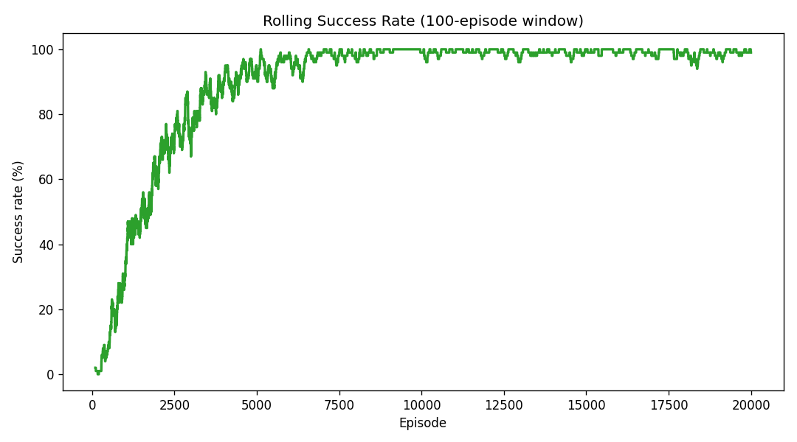
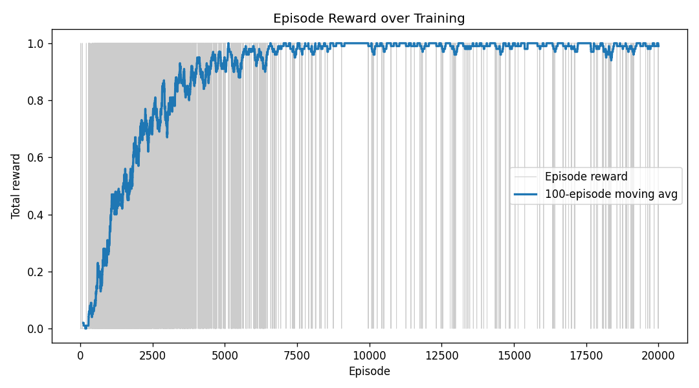
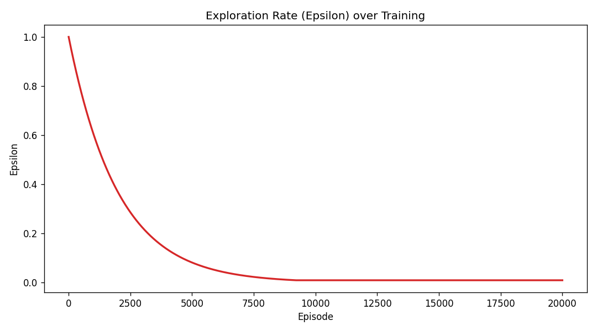
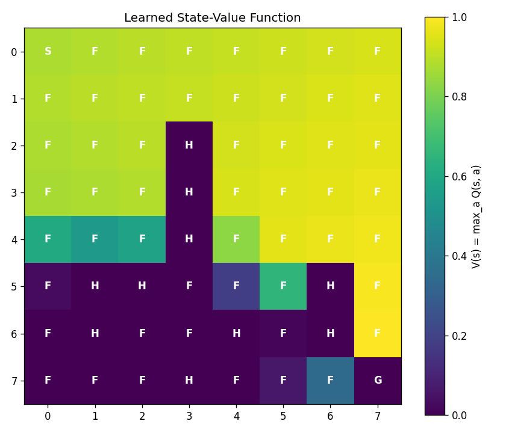

```{=typst}
#align(center + horizon)[
  #text(22pt)[Reinforcement Learning — Assignment 1]
  #v(26pt)
  #text(16pt)[Frozen Lake from First Principles\ using Q-Learning]
  #v(28pt)
  #text(12pt)[DSCD 614 — Reinforcement Learning · Programming Assignment 1]
  #v(8pt)
  #text(12pt)[University of Ghana · Department of Computer Science]
  #v(8pt)
  #text(12pt)[Semester II, 2025/2026]
  #v(46pt)
  #text(14pt)[Richard Gbamara]
  #v(6pt)
  #text(13pt)[Student ID: 22427514]
]
#pagebreak()
```

```{=openxml}
<w:p/><w:p/><w:p/><w:p/><w:p/><w:p/>
<w:p><w:pPr><w:jc w:val="center"/></w:pPr><w:r><w:rPr><w:sz w:val="44"/></w:rPr><w:t>Reinforcement Learning — Assignment 1</w:t></w:r></w:p>
<w:p/>
<w:p><w:pPr><w:jc w:val="center"/></w:pPr><w:r><w:rPr><w:sz w:val="32"/></w:rPr><w:t>Frozen Lake from First Principles using Q-Learning</w:t></w:r></w:p>
<w:p/>
<w:p><w:pPr><w:jc w:val="center"/></w:pPr><w:r><w:rPr><w:sz w:val="24"/></w:rPr><w:t>DSCD 614 — Reinforcement Learning · Programming Assignment 1</w:t></w:r></w:p>
<w:p><w:pPr><w:jc w:val="center"/></w:pPr><w:r><w:rPr><w:sz w:val="24"/></w:rPr><w:t>University of Ghana · Department of Computer Science</w:t></w:r></w:p>
<w:p><w:pPr><w:jc w:val="center"/></w:pPr><w:r><w:rPr><w:sz w:val="24"/></w:rPr><w:t>Semester II, 2025/2026</w:t></w:r></w:p>
<w:p/><w:p/>
<w:p><w:pPr><w:jc w:val="center"/></w:pPr><w:r><w:rPr><w:sz w:val="28"/></w:rPr><w:t>Richard Gbamara</w:t></w:r></w:p>
<w:p><w:pPr><w:jc w:val="center"/></w:pPr><w:r><w:rPr><w:sz w:val="26"/></w:rPr><w:t>Student ID: 22427514</w:t></w:r></w:p>
<w:p><w:r><w:br w:type="page"/></w:r></w:p>
```

## 1. Introduction

Reinforcement Learning (RL) studies how an agent can learn to act within an
environment so as to maximise a long-run cumulative reward. At each time
step the agent observes a state, selects an action, and receives a scalar
reward together with the next state. Unlike supervised learning there are no
labelled examples: the agent must discover a good policy purely from delayed
and often sparse reward signals, continually balancing the exploration of
unfamiliar actions against the exploitation of actions it already believes to
be good.

This report presents a complete solution to the Frozen Lake problem — an 8×8
grid-world in which an agent must cross a frozen lake from a Start tile (`S`) to a
Goal tile (`G`), stepping only on Frozen tiles (`F`) and avoiding Holes (`H`),
which end the episode in failure. The entire solution is built from first
principles in plain Python with NumPy: the environment, the Q-Learning
algorithm, the training loop and the evaluation routines are all hand-written.
No Reinforcement Learning framework (Gymnasium, OpenAI Gym, Stable Baselines,
RLlib, etc.) is used; `matplotlib` is used only for plotting.

The standard 8×8 map solved here is:

```
S F F F F F F F
F F F F F F F F
F F F H F F F F
F F F H F F F F
F F F H F F F F
F H H F F F H F
F H F F H F H F
F F F H F F F G
```

## 2. Environment Design

The environment is encapsulated in the `FrozenLakeEnv` class (`environment.py`),
which exposes the required API — `reset()`, `step(action)`, `render()`,
`get_state()` and `is_terminal()` — and is responsible for maintaining the
current state, enforcing boundaries, detecting holes and the goal, returning
rewards, and signalling episode termination.

State representation: Each of the 64 cells is encoded as a single integer
index `s = row · n_cols + col`, giving 64 discrete states. This compact encoding
indexes directly into a `64 × 4` Q-table (256 entries).

Action representation: Four discrete actions, exactly as specified in the
brief: `0 = Left`, `1 = Down`, `2 = Right`, `3 = Up`. A move that would leave the
grid is clipped to the boundary, leaving the agent in place.

Reward structure: The implemented scheme is the standard sparse formulation:

| Event | Reward | Episode |
|:------|:------:|:--------|
| Reach the Goal (`G`) | +1.0 | terminates |
| Fall into a Hole (`H`) | 0.0 | terminates |
| Any other (Frozen) step | 0.0 | continues |

A maximum-step cap of 200 prevents non-terminating trajectories during the highly
exploratory early phase of training. Because the only positive signal comes from
the goal, the agent must propagate that value backwards through the Q-table via
bootstrapping — a deliberately challenging long-horizon credit-assignment problem.

## 3. Q-Learning Algorithm

Q-Learning (`agent.py`) is an off-policy, model-free, value-based
temporal-difference control method. It learns an action-value table `Q(s, a)`
(64×4, initialised to zero) estimating the expected discounted return of taking
action `a` in state `s` and behaving greedily thereafter. After every transition
`(s, a, r, s')` the table is updated exactly as required by the brief:

$$ Q(s,a) \leftarrow Q(s,a) + \alpha\,\big[\,r + \gamma \max_{a'} Q(s',a') - Q(s,a)\,\big] $$

Here `α` is the learning rate (how quickly new experience overrides the old
estimate), `γ` is the discount factor (how much future reward is valued
relative to immediate reward), and the bracketed quantity is the
temporal-difference (TD) error — the gap between the bootstrapped target
`r + γ·maxₐ' Q(s',a')` and the current estimate. When `s'` is terminal the
bootstrap term is dropped and the target collapses to `r`.

Exploration strategy: Action selection uses an ε-greedy policy: with
probability `ε` a uniformly random action is taken, otherwise the greedy action
`argmaxₐ Q(s, a)`. `ε` decays multiplicatively each episode from `1.0` toward a
floor of `0.01`, so the agent explores aggressively early and exploits its
learned policy later. Crucially, greedy ties are broken uniformly at random,
preventing a directional bias toward action 0 while Q-rows are still flat.

## 4. Training Methodology

The training loop (`train.py`) runs each episode until the agent reaches the
goal, falls into a hole, or hits the 200-step cap. The Q-update is applied after
every step and `ε` is decayed at the end of every episode. For every episode the
script logs the total reward, number of steps, success flag and value of `ε`, and
maintains a rolling 100-episode success rate.

| Hyperparameter | Value | | Hyperparameter | Value |
|:---|:--:|---|:---|:--:|
| Episodes | 20,000 | | Initial ε | 1.0 |
| Learning rate α | 0.1 | | Minimum ε | 0.01 |
| Discount factor γ | 0.99 | | ε decay (per episode) | 0.9995 |
| Max steps/episode | 200 | | Random seed | 42 |
| Q-table init | zeros | | Slippery transitions | No |

These values were selected by experimentation. A moderate `α = 0.1` gives stable
updates; a high `γ = 0.99` is essential because the single reward lies many steps
from the start; and a slow `ε`-decay of `0.9995` keeps exploration alive long
enough to discover the goal while still committing to a policy within ~10,000
episodes.

## 5. Experimental Results

Training: Over 20,000 episodes the agent succeeded in 17,936 of them
(89.68% overall). The rolling success rate climbs from roughly 18% in the first
thousand episodes to 99.0% over the final 1,000 episodes, tracking the `ε`
schedule closely.

Greedy evaluation (exploration disabled, `evaluate.py`):

| Metric | 100 episodes | 1,000 episodes |
|:-------|:------------:|:--------------:|
| Success Rate | 100.00% | 100.00% |
| Average Reward | 1.0000 | 1.0000 |
| Number of Failures | 0 | 0 |
| Number of Successful Runs | 100 | 1,000 |
| Average Steps to Goal | 14.00 | 14.00 |

The average path length settles at exactly 14 steps — the shortest possible
route on this grid (7 Down + 7 Right from corner to corner). This confirms the
agent has not merely learned *a* successful policy but an *optimal* one.

{width=62%}

Figure 1: Rolling success rate over training (100-episode moving window).

{width=62%}

Figure 2: Episode reward with 100-episode moving average.

{width=62%}

Figure 3: Exploration rate (ε) decay over training.

{width=62%}

Figure 4: Learned state-value function V(s) = maxₐ Q(s,a).

## 6. Learned Policy

The greedy policy extracted from the converged Q-table (`policy.py`) is:

```
↓ ↓ ↓ ↓ ↓ ↓ ↓ ↓
→ → → → ↓ ↓ ↓ ↓
↑ ↑ ↑ H → → ↓ ↓
↑ ↑ ↑ H → → ↓ ↓
↑ ↑ ↑ H → → → ↓
↑ H H → → ↑ H ↓
↑ H ← ← H ↓ H ↓
← ← ← H ← → → G
```

The arrows give the recommended action for every non-terminal state; holes are
shown as `H` and the goal as `G`. The policy threads the agent around the
vertical wall of holes in column 3 and down the right-hand region to the goal in
the bottom-right corner. Several cells in the lower-left region are never visited
by an agent following this policy from the start; the arrows shown there are the
greedy actions of the Q-table but have no effect on behaviour because those states
are unreachable under the learned policy (and the arrows on hole tiles are never
executed, since those states are terminal).

## 7. Bonus Task — Option B: Visualising Training Performance

For the bonus, Option B (visualisation of training performance) was
implemented (`visualize.py`). The per-episode reward, success flag and exploration
rate logged during training are rendered into the four graphs already presented in
Section 5:

* Figure 1 — Rolling success rate: climbs from ~0% to ~100% within roughly
  7,000 episodes and then plateaus.
* Figure 2 — Episode reward with moving average: mirrors the success curve as
  the agent reliably reaches the goal.
* Figure 3 — Exploration rate (ε) decay: ε anneals smoothly from 1.0 to its
  0.01 floor.
* Figure 4 — Learned state-value heatmap: `V(s) = maxₐ Q(s,a)`, with value
  rising along the safe corridor toward the goal.

Read together, these plots tell the complete learning story: as `ε` decays the
reward and success rate rise sharply and then plateau near their maxima, while the
greedy path length collapses to the optimal 14 steps — visual confirmation that
exploring early and exploiting later produces a reliable, optimal policy.

## 8. Challenges Encountered

* Sparse reward and exploration: Because reward is zero everywhere except at
  the goal, the agent learns nothing until random exploration first stumbles onto
  `G`, after which the non-zero TD signal can propagate backwards. A high initial
  `ε = 1.0`, a generous 200-step cap and a slow decay were all necessary to ensure
  the goal is discovered early enough.
* Tie-breaking bias: A naive `argmax` over a flat (all-zero) Q-row always
  returns action 0 (Left), so early in training the agent hugged the left wall and
  rarely reached the goal. Breaking ties uniformly at random removed this bias and
  roughly halved the time to convergence.
* Hyperparameter sensitivity: An `ε`-decay too close to 1.0 keeps exploration
  alive too long, while a much smaller value (e.g. 0.99) causes premature
  commitment to a sub-optimal route. The chosen `0.9995` balances these and
  reliably converges within ~10,000 episodes. A high discount factor (`γ = 0.99`)
  was likewise required for the single terminal reward to reach the start state.
* Reward shaping (considered): A shaped reward (a small per-step penalty plus a
  negative hole reward) was considered to encourage shorter paths; in practice the
  sparse `+1`-only scheme already converges to the optimal 14-step path, so the
  simpler formulation was retained.

## 9. Conclusion

A tabular Q-Learning agent, implemented entirely from first principles, is fully
sufficient to master the deterministic 8×8 Frozen Lake task. With `α = 0.1`,
`γ = 0.99` and exponentially decaying ε-greedy exploration, the agent achieves a
100% success rate in greedy evaluation (over both 100 and 1,000 episodes) and
consistently follows the optimal 14-step path from Start to Goal. The
experiments confirm the core principles of value-based RL: the role of the TD
update, decaying exploration, discounting, and random tie-breaking in converging
to an optimal policy. The complete source code, results, plots and execution
instructions are provided in the accompanying GitHub repository; optional
extensions such as slippery (stochastic) transitions can be enabled through
command-line flags on `train.py`.

```{=typst}
#pagebreak()
```
```{=openxml}
<w:p><w:r><w:br w:type="page"/></w:r></w:p>
```

# Appendices

The appendices below provide the full supporting detail behind the report: the
complete environment reference, the entire learned Q-table, the training
statistics broken down over time, and the files needed to reproduce the results.

## Appendix A — Environment Reference

State-index map: Each cell's integer state index (`s = row · 8 + col`):

```
 0  1  2  3  4  5  6  7
 8  9 10 11 12 13 14 15
16 17 18 19 20 21 22 23
24 25 26 27 28 29 30 31
32 33 34 35 36 37 38 39
40 41 42 43 44 45 46 47
48 49 50 51 52 53 54 55
56 57 58 59 60 61 62 63
```

Special states: Start = `0`; Goal (`G`) = `63`; Holes (`H`) =
`{19, 27, 35, 41, 42, 46, 49, 52, 54, 59}`.

Action encoding:

| Code | 0 | 1 | 2 | 3 |
|:--|:--:|:--:|:--:|:--:|
| Action | Left | Down | Right | Up |
| Effect | col−1 | row+1 | col+1 | row−1 |

Reward function:

| Event | Reward | Terminal? |
|:--|:--:|:--:|
| Reach Goal `G` | +1.0 | Yes |
| Fall into Hole `H` | 0.0 | Yes |
| Step on Frozen `F` | 0.0 | No |

```{=typst}
#pagebreak()
```
```{=openxml}
<w:p><w:r><w:br w:type="page"/></w:r></w:p>
```

## Appendix B — Full Learned Q-Table (all 64 states)

Every state's four Q-values, its grid coordinate and tile type, and the greedy
("Best") action. Terminal tiles (`H`, `G`) keep all-zero rows and are never
updated, so their best action is marked `—`.

States 0–31 (top half of the grid):

| State | (r,c) | Tile | Left | Down | Right | Up | Best |
|:--:|:--:|:--:|:--:|:--:|:--:|:--:|:--:|
| 0 | (0,0) | S | 0.869 | 0.878 | 0.878 | 0.869 | Down |
| 1 | (0,1) | F | 0.869 | 0.886 | 0.886 | 0.878 | Down |
| 2 | (0,2) | F | 0.877 | 0.895 | 0.895 | 0.886 | Down |
| 3 | (0,3) | F | 0.886 | 0.904 | 0.904 | 0.895 | Down |
| 4 | (0,4) | F | 0.895 | 0.914 | 0.912 | 0.904 | Down |
| 5 | (0,5) | F | 0.902 | 0.923 | 0.922 | 0.910 | Down |
| 6 | (0,6) | F | 0.905 | 0.932 | 0.914 | 0.917 | Down |
| 7 | (0,7) | F | 0.806 | 0.941 | 0.861 | 0.810 | Down |
| 8 | (1,0) | F | 0.878 | 0.869 | 0.886 | 0.869 | Right |
| 9 | (1,1) | F | 0.878 | 0.878 | 0.895 | 0.878 | Right |
| 10 | (1,2) | F | 0.886 | 0.886 | 0.904 | 0.886 | Right |
| 11 | (1,3) | F | 0.895 | 0.000 | 0.914 | 0.895 | Right |
| 12 | (1,4) | F | 0.904 | 0.923 | 0.923 | 0.904 | Down |
| 13 | (1,5) | F | 0.914 | 0.932 | 0.932 | 0.914 | Down |
| 14 | (1,6) | F | 0.923 | 0.941 | 0.941 | 0.923 | Down |
| 15 | (1,7) | F | 0.932 | 0.951 | 0.941 | 0.926 | Down |
| 16 | (2,0) | F | 0.868 | 0.851 | 0.877 | 0.878 | Up |
| 17 | (2,1) | F | 0.869 | 0.867 | 0.886 | 0.886 | Up |
| 18 | (2,2) | F | 0.877 | 0.873 | 0.000 | 0.895 | Up |
| 19 | (2,3) | H | 0.000 | 0.000 | 0.000 | 0.000 | — |
| 20 | (2,4) | F | 0.000 | 0.920 | 0.932 | 0.909 | Right |
| 21 | (2,5) | F | 0.923 | 0.941 | 0.941 | 0.923 | Right |
| 22 | (2,6) | F | 0.932 | 0.951 | 0.951 | 0.932 | Down |
| 23 | (2,7) | F | 0.941 | 0.961 | 0.951 | 0.941 | Down |
| 24 | (3,0) | F | 0.423 | 0.317 | 0.764 | 0.867 | Up |
| 25 | (3,1) | F | 0.654 | 0.323 | 0.716 | 0.877 | Up |
| 26 | (3,2) | F | 0.696 | 0.306 | 0.000 | 0.886 | Up |
| 27 | (3,3) | H | 0.000 | 0.000 | 0.000 | 0.000 | — |
| 28 | (3,4) | F | 0.000 | 0.489 | 0.941 | 0.619 | Right |
| 29 | (3,5) | F | 0.917 | 0.940 | 0.951 | 0.929 | Right |
| 30 | (3,6) | F | 0.941 | 0.961 | 0.961 | 0.941 | Down |
| 31 | (3,7) | F | 0.951 | 0.970 | 0.961 | 0.951 | Down |

States 32–63 (bottom half of the grid):

| State | (r,c) | Tile | Left | Down | Right | Up | Best |
|:--:|:--:|:--:|:--:|:--:|:--:|:--:|:--:|
| 32 | (4,0) | F | 0.026 | 0.000 | 0.075 | 0.607 | Up |
| 33 | (4,1) | F | 0.071 | 0.000 | 0.087 | 0.536 | Up |
| 34 | (4,2) | F | 0.111 | 0.000 | 0.000 | 0.575 | Up |
| 35 | (4,3) | H | 0.000 | 0.000 | 0.000 | 0.000 | — |
| 36 | (4,4) | F | 0.000 | 0.027 | 0.829 | 0.337 | Right |
| 37 | (4,5) | F | 0.503 | 0.381 | 0.961 | 0.863 | Right |
| 38 | (4,6) | F | 0.951 | 0.000 | 0.970 | 0.951 | Right |
| 39 | (4,7) | F | 0.961 | 0.980 | 0.970 | 0.961 | Down |
| 40 | (5,0) | F | 0.000 | 0.000 | 0.000 | 0.029 | Up |
| 41 | (5,1) | H | 0.000 | 0.000 | 0.000 | 0.000 | — |
| 42 | (5,2) | H | 0.000 | 0.000 | 0.000 | 0.000 | — |
| 43 | (5,3) | F | 0.000 | 0.000 | 0.001 | 0.000 | Right |
| 44 | (5,4) | F | 0.000 | 0.000 | 0.184 | 0.113 | Right |
| 45 | (5,5) | F | 0.027 | 0.002 | 0.000 | 0.653 | Up |
| 46 | (5,6) | H | 0.000 | 0.000 | 0.000 | 0.000 | — |
| 47 | (5,7) | F | 0.000 | 0.990 | 0.980 | 0.970 | Down |
| 48 | (6,0) | F | 0.000 | 0.000 | 0.000 | 0.000 | Up |
| 49 | (6,1) | H | 0.000 | 0.000 | 0.000 | 0.000 | — |
| 50 | (6,2) | F | 0.000 | 0.000 | 0.000 | 0.000 | Left |
| 51 | (6,3) | F | 0.000 | 0.000 | 0.000 | 0.000 | Left |
| 52 | (6,4) | H | 0.000 | 0.000 | 0.000 | 0.000 | — |
| 53 | (6,5) | F | 0.000 | 0.012 | 0.000 | 0.000 | Down |
| 54 | (6,6) | H | 0.000 | 0.000 | 0.000 | 0.000 | — |
| 55 | (6,7) | F | 0.000 | 1.000 | 0.990 | 0.980 | Down |
| 56 | (7,0) | F | 0.000 | 0.000 | 0.000 | 0.000 | Left |
| 57 | (7,1) | F | 0.000 | 0.000 | 0.000 | 0.000 | Left |
| 58 | (7,2) | F | 0.000 | 0.000 | 0.000 | 0.000 | Left |
| 59 | (7,3) | H | 0.000 | 0.000 | 0.000 | 0.000 | — |
| 60 | (7,4) | F | 0.000 | 0.000 | 0.000 | 0.000 | Left |
| 61 | (7,5) | F | 0.000 | 0.000 | 0.066 | 0.001 | Right |
| 62 | (7,6) | F | 0.003 | 0.000 | 0.344 | 0.000 | Right |
| 63 | (7,7) | G | 0.000 | 0.000 | 0.000 | 0.000 | — |

Note how Q-values are highest along the agent's actual route (the top rows and
column 7) and remain near zero in the unreachable lower-left region, which the
optimal policy never visits.

```{=typst}
#pagebreak()
```
```{=openxml}
<w:p><w:r><w:br w:type="page"/></w:r></w:p>
```

## Appendix C — Training Statistics by Milestone

Per-episode statistics from `results/training_stats.npz`, aggregated in blocks of
2,000 episodes. The success rate rises and the average path length falls toward
the optimal 14 steps as `ε` decays.

| Episode range | Success rate | Avg steps | ε (end of range) |
|:--:|:--:|:--:|:--:|
| 1–2000 | 32.1% | 27.5 | 0.368 |
| 2001–4000 | 79.2% | 17.5 | 0.135 |
| 4001–6000 | 93.5% | 15.1 | 0.050 |
| 6001–8000 | 97.4% | 14.4 | 0.018 |
| 8001–10000 | 99.4% | 14.1 | 0.010 |
| 10001–12000 | 99.2% | 14.1 | 0.010 |
| 12001–14000 | 99.1% | 14.1 | 0.010 |
| 14001–16000 | 99.2% | 14.1 | 0.010 |
| 16001–18000 | 99.1% | 14.1 | 0.010 |
| 18001–20000 | 98.6% | 14.1 | 0.010 |

Overall: 17,936 / 20,000 successful training episodes (89.68%); 99.0% over the
final 1,000 episodes.

```{=typst}
#pagebreak()
```
```{=openxml}
<w:p><w:r><w:br w:type="page"/></w:r></w:p>
```

## Appendix D — Files and Reproducibility

| File | Description |
|:--|:--|
| `environment.py` | Custom `FrozenLakeEnv` (Part A) |
| `agent.py` | Q-Learning agent (Part B) |
| `train.py` | Training loop + statistics (Part C) |
| `policy.py` | Policy extraction & grid display (Part D) |
| `evaluate.py` | Greedy evaluation (Part E) |
| `visualize.py` | Bonus B graphs & value heatmap |
| `results/q_table.npy` | Saved 64×4 Q-table (Appendix B) |
| `results/training_stats.npz` | Per-episode reward, success, steps, ε (Appendix C) |
| `results/*.png` | Generated graphs (Section 5) |

Reproduce the results (fixed `seed = 42`):

```
pip install -r requirements.txt
python train.py            # trains 20,000 episodes, saves Q-table, stats, graphs
python evaluate.py --episodes 1000
```
